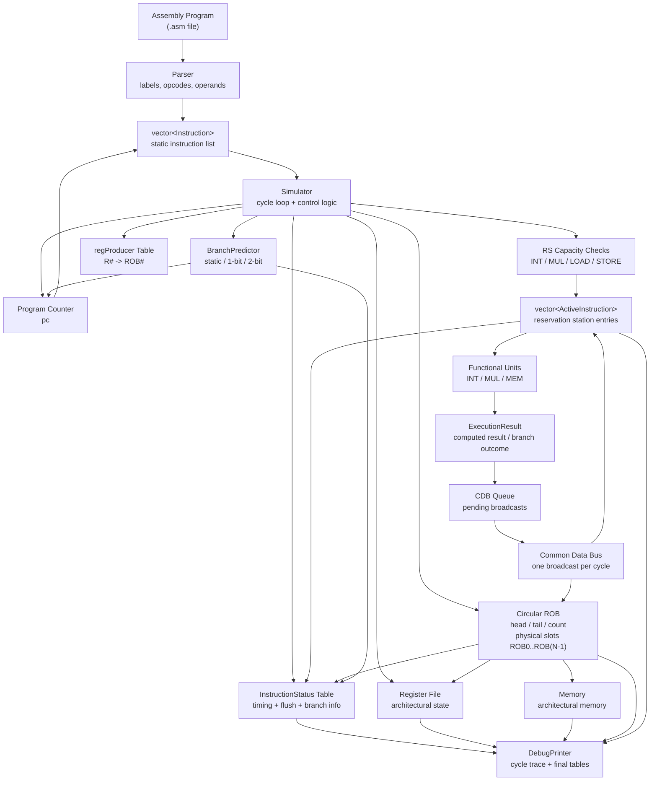

# Tomasulo Simulator

A cycle-based out-of-order CPU simulator written in C++.

This project simulates core ideas from Tomasulo-style dynamic scheduling, including reservation stations, register renaming, functional unit contention, common data bus writeback, branch prediction, speculative recovery, and circular reorder buffer commit.

The goal is to show how instructions move through an out-of-order execution engine cycle by cycle.

---

## Current Features

- Cycle-based Tomasulo-style out-of-order execution simulator
- In-order issue with out-of-order execution and in-order ROB commit
- Reservation stations for integer, multiply, load, and store operations
- Functional unit capacity limits and structural hazard handling
- Register renaming with physical ROB producer tags and `Vj` / `Vk` / `Qj` / `Qk` operand tracking
- True circular Reorder Buffer with reusable physical slots
- Separate dynamic instruction IDs (`I#`) and physical ROB tags (`ROB#`)
- Precise in-order commit from the circular ROB head
- Store commit through the ROB
- Flush support for younger wrong-path instructions in reservation stations, ROB, CDB, and register producer table
- Common Data Bus with single-result broadcast per cycle
- Speculative branch execution with misprediction recovery
- Static, 1-bit, and 2-bit branch predictor modes indexed by static PC
- Cycle-by-cycle debug output, instruction timing table, and branch prediction summary
- Automated test runner and GUI test-file generator


---

## Supported Instructions

The simulator currently supports:

```asm
ADD R1, R2, R3
ADDI R1, R1, 5
SUB R1, R2, R3
MUL R1, R2, R3
LD  R1, offset(R2)
SD  R1, offset(R2)
BNE R1, R2, loop
BEQ R1, R2, loop
```

Example:

```asm
LD R1, 0(R0)
ADD R2, R1, R3
MUL R4, R2, R5
```

---

## Architecture Overview



Instructions issue in program order, wait in reservation stations until operands and functional units are available, execute when ready, write register results through the CDB or non-register results directly into the ROB, and finally commit in order from the circular ROB head.

---

## ROB and Tag Model

The simulator separates dynamic instruction identity from physical ROB storage:

```text
I#    = dynamic instruction ID used for debug output and the instruction status table
ROB#  = physical circular ROB slot used for renaming, operand dependencies, CDB wakeup, and commit storage
```

For example, dynamic instruction `I17` may occupy physical slot `ROB0`. Later, after that entry commits, `ROB0` may be reused by a newer instruction such as `I21`.

The register producer table, `Qj`, and `Qk` all store physical ROB tags:

```text
Register Producers:
  R2 <- ROB1

Active Instructions:
  I24: BNE R2, R0, inner | qj: ROB1
```

The CDB carries both identifiers:

```text
producerTag = dynamic instruction ID, used for printing/status table
robTag      = physical ROB slot, used for ROB writeback and dependency wakeup
```

This keeps debug output readable while allowing physical ROB slots to wrap around and be reused.

---

## Cycle Timing Model

Each simulator cycle currently follows this order:

```text
1. Issue one instruction if possible
2. Execute / decrement active instructions
3. Print debug state
4. Commit one ready circular ROB head entry
5. Broadcast one old CDB result
6. Complete newly finished instructions
7. Queue new CDB/store/branch results
8. Advance to next cycle
```

This means a register-writing instruction that finishes execution in cycle `N` queues a CDB result at the end of cycle `N`.

It can broadcast in cycle `N + 1`.

It can commit no earlier than cycle `N + 2`, assuming it is at the head of the ROB.

---

## Build

Requirements:

* C++17
* CMake
* g++

On Ubuntu:

```bash
sudo apt update
sudo apt install build-essential cmake
```

Build the project:

```bash
mkdir -p build
cd build
cmake ..
make
```

---

## Run

From the `build/` directory:

```bash
./simulator
```

This runs the default input file configured in `main.cpp`.

To run a specific test file:

```bash
./simulator ../tests/basic_arithmetic.asm
```

To choose a branch predictor:

```bash
./simulator ../tests/nested_loop.asm --predictor two-bit
```

## Browser Visualizer

The browser visualizer can still load `trace.json` manually, or it can run the local simulator through a small Flask backend.

Build the simulator first:

```bash
mkdir -p build
cd build
cmake ..
make
cd ..
```

Install Flask:

```bash
python3 -m pip install Flask
```

Run the local backend from the repository root:

```bash
python3 server/app.py
```

Open the visualizer at:

```text
http://127.0.0.1:5000
```

Paste assembly into the text area or load an `.asm` file, then click **Run Simulation**. The backend writes the code to a temporary file, runs `./build/simulator`, reads the generated `trace.json`, and returns it to the visualizer.

This server is intended for local development only. It binds to `127.0.0.1`, runs the simulator without a shell, and applies a short execution timeout.

## Example Program

```asm
ADD R1, R3, R5
SUB R2, R3, R5
MUL R4, R3, R5
```

This tests arithmetic functions and committing to architectural register.

Expected behavior:

```text
I0: ADD R1, R3, R5 -> R1 = 7
I1: SUB R2, R3, R5 -> R2 = 3
I2: MUL R4, R3, R5 -> R4 = 10
```

---

## Example Debug Output

The simulator prints detailed cycle-by-cycle state, including:

```text
FU State
RS State
Register Producers
Active Instructions
CDB Queue
ROB
ROB Commit
CDB Broadcast
```

Example ROB output:

```text
ROB: 4/4 | head: ROB1 | tail: ROB1
  ROB1 | I1 | ADDI R3, R0, 0  | ready: yes | R3 = 0
  ROB2 | I2 | ADDI R4, R0, 10 | ready: no
  ROB3 | I3 | ADDI R5, R0, 1  | ready: no
  ROB0 | I4 | ADDI R2, R0, 4  | ready: no
```

Example producer and wakeup output:

```text
Register Producers:
  R2 <- ROB1

Active Instructions:
  I24: BNE R2, R0, inner | qj: ROB1

CDB Broadcast: I23 SUB R2, R2, R5
  Broadcast: I23
  ROB Write: ROB1 / I23 value = 3 -> R2
  Wakeup: I24 qj resolved by ROB1 / I23 with value 3
```

Example issue stall:

```text
ROB: 4/4 | head: ROB3 | tail: ROB3
Issue stalled: LD R5, 4(R1) | ROB full
```

---

## Test Programs

Example test files are stored in:

```text
tests/
```

These tests cover arithmetic, RAW dependencies, repeated writes to the same register, self-dependencies, CDB contention, out-of-order writeback, ROB capacity stalls, load-use dependencies, store commit behavior, branches, nested loops, speculative execution, and wrong-path flush behavior.

Test files can be easily created using the GUI displayed when running:
```bash
python3 tests/create_test.py
```
The GUI asks for:
```text
File name
Test title
Description
Expected registers
Expected memory
Expected commit counts
Assembly code
```

Testing is automated by running:
```bash
python3 tests/run_tests.py
```

Automated testing runs all test files located in `tests/` and verifies expected final register values, memory values, and optional commit-count expectations.
```text
[FAIL] add_immediate.asm
R1: expected 8, got 7
[PASS] backward_branch.asm
```

Expectations are written as:
```asm
# EXPECT_REG R1 5
# EXPECT_MEM 0 99
# EXPECT_COMMIT_COUNT ADD R2, R1, R3 1
```

---

## Current Limitations

* The simulator supports a small custom ISA rather than full RISC-V.
* Load-store ordering is simplified.
* There is no full load-store queue yet.
* Memory disambiguation is not implemented.
* Functional units and reservation station sizes are currently fixed constants in the simulator.
* Automated tests validate final register/memory state and selected commit-count behavior, but they do not yet validate branch prediction accuracy as a correctness requirement.

---

## Planned Features

* More branch-speculation test cases
* Load-store queue
* Stronger load/store ordering and memory dependency checks
* CPI and performance experiments
* More configurable simulator parameters
* Optional validation of branch prediction statistics in tests

---

## Project Status

The simulator currently implements Tomasulo-style out-of-order execution with reservation stations, physical ROB-tag-based register renaming, a single-broadcast CDB, a true circular ROB with reusable slots, in-order commit, and branch speculation. It includes static, 1-bit, and 2-bit branch predictor modes, misprediction recovery by flushing younger wrong-path instructions, and branch prediction summary output with predictor state and accuracy reporting.
