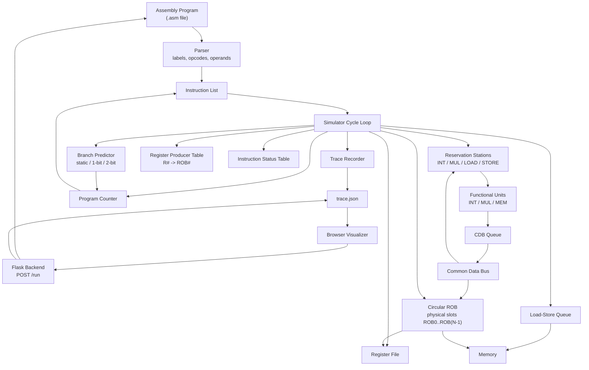

# Tomasulo Simulator

A cycle-based Tomasulo-style out-of-order CPU simulator written in C++, with a browser visualizer and a local Flask backend for running simulations from the web UI.

The goal is to show how instructions move through an out-of-order execution engine cycle by cycle: issue, reservation station wait, execution, CDB writeback, ROB commit, branch recovery, memory ordering, and trace visualization.

---

## Current Features

- In-order issue with out-of-order execution and in-order ROB commit
- Reservation stations for integer, multiply, load, and store operations
- Load and store buffers backed by an LSQ
- Register renaming using physical ROB producer tags
- `Vj` / `Vk` / `Qj` / `Qk` operand dependency tracking
- Circular Reorder Buffer with reusable physical slots
- Separate dynamic instruction IDs (`I#`) and physical ROB tags (`ROB#`)
- Single-result Common Data Bus broadcast per cycle
- Store commit through the ROB
- Address-aware load/store handling through the LSQ
- Store-to-load forwarding from ready older stores
- Wrong-path flush support for reservation stations, ROB, CDB queue, LSQ, and register producer table
- Branch prediction modes:
  - `always-not-taken`
  - `always-taken`
  - `one-bit`
  - `two-bit`
- Branch misprediction recovery with PC redirect and younger-instruction flush
- Cycle-by-cycle debug output
- Instruction timing table and branch prediction summary
- `trace.json` export for visualization
- Browser visualizer for stepping through trace snapshots
- Local Flask backend for running assembly from the browser
- Automated test runner for final architectural state and selected commit counts

---

## Supported ISA

The parser supports this small custom ISA:

```asm
ADD  R1, R2, R3
ADDI R1, R1, 5
SUB  R1, R2, R3
MUL  R1, R2, R3
LD   R1, offset(R2)
SD   R1, offset(R2)
BEQ  R1, R2, label
BNE  R1, R2, label
```

Labels can appear on their own line or before an instruction:

```asm
loop:
ADDI R1, R1, -1
BNE R1, R0, loop
```

---

## Architecture Overview



Instructions issue in program order, wait in reservation stations until operands and functional units are available, execute when ready, write register results through the CDB or non-register results directly into the ROB, and commit in order from the circular ROB head.

---

## ROB and Tag Model

The simulator separates dynamic instruction identity from physical ROB storage:

```text
I#    = dynamic instruction ID used for debug output and status tables
ROB#  = physical circular ROB slot used for renaming, dependencies, CDB wakeup, and commit storage
```

For example, dynamic instruction `I17` may occupy physical slot `ROB0`. Later, after that entry commits, `ROB0` may be reused by a newer instruction.

The register producer table and reservation station source tags store physical ROB tags:

```text
Register Producers:
  R2 <- ROB1

Active Instructions:
  I24: BNE R2, R0, loop | qj: ROB1
```

The CDB carries both identifiers:

```text
producerTag = dynamic instruction ID, used for printing/status table
robTag      = physical ROB slot, used for ROB writeback and dependency wakeup
```

---

## Cycle Timing Model

Each simulator cycle currently follows this order:

```text
1. Issue one instruction if possible
2. Execute / decrement active instructions
3. Print debug state
4. Commit one ready circular ROB head entry
5. Broadcast one old CDB result
6. Complete newly finished instructions
7. Queue new CDB/store/branch results
8. Record trace snapshot
9. Advance to next cycle
```

A register-writing instruction that finishes execution in cycle `N` queues a CDB result at the end of cycle `N`, can broadcast in cycle `N + 1`, and can commit no earlier than cycle `N + 2` if it is at the ROB head.

---

## Trace JSON

The simulator writes `trace.json` after each run. The browser visualizer uses this file as its cycle-by-cycle data source.

Each cycle snapshot includes fields such as:

- `cycle`
- `pc`
- `predictorType`
- `issuedInstruction`
- `cdbBroadcast`
- `commitEvent`
- `activeInstructions`
- `rob.entries`, `rob.head`, `rob.tail`, `rob.count`
- `lsq`
- `registers`
- `memory`
- `registerProducers`
- `branchPredictions`
- `events`

The trace is intentionally additive: newer visualizer panels use newer fields, while older trace files without those fields should still load without crashing.

---

## Build

Requirements:

- C++17 compiler
- CMake
- Python 3 for tests and the visualizer backend
- Flask for the local backend

Build from the repository root:

```bash
cmake -S . -B build
cmake --build build
```

---

## Run the Simulator Directly

Run the default program configured in `src/main.cpp`:

```bash
./build/simulator
```

Run a specific program:

```bash
./build/simulator examples/fibonacci_loop.asm
```

Choose a branch predictor:

```bash
./build/simulator examples/fibonacci_loop.asm --predictor two-bit
```

Accepted predictor names:

```text
always-not-taken
always-taken
one-bit
two-bit
```

Accepted aliases:

```text
not-taken
taken
1bit
1-bit
2bit
2-bit
```

---

## Browser Visualizer

The browser visualizer can load an existing `trace.json` manually or run the simulator through the local Flask backend.

Current UI panels include:

- Cycle controls with previous/next, play/pause, and slider
- Optional `.asm` loader and program listing with PC highlight
- Branch predictor dropdown before running a simulation
- Architectural datapath view
- Events panel
- ROB table
- Reservation station and load/store buffer tables
- LSQ table
- Register producer table
- Branch predictor summary and branch prediction table
- Register state table
- Memory state table

### Backend Setup

Create and activate a virtual environment:

```bash
python3 -m venv .venv
source .venv/bin/activate
```

Install Flask:

```bash
pip install Flask
```

Build the simulator before starting the backend:

```bash
cmake -S . -B build
cmake --build build
```

Run the backend from the repository root:

```bash
python3 server/app.py
```

Open:

```text
http://127.0.0.1:5000
```

### Backend Workflow

The backend is intended for local development only. It binds to `127.0.0.1`.

When you click **Run Simulation**:

1. The frontend sends assembly code and the selected predictor mode to `POST /run`.
2. The backend writes the assembly to a temporary `.asm` file.
3. The backend runs `build/simulator` without a shell.
4. The simulator writes `trace.json`.
5. The backend reads `trace.json` and returns it to the browser.
6. The visualizer renders the returned trace.

---

## Example Program

```asm
ADD R1, R3, R5
SUB R2, R3, R5
MUL R4, R3, R5
```

This tests arithmetic functions and committing to architectural register.

Expected behavior:

```text
I0: ADD R1, R3, R5 -> R1 = 7
I1: SUB R2, R3, R5 -> R2 = 3
I2: MUL R4, R3, R5 -> R4 = 10
```

---

## Debug Output

The simulator prints detailed cycle-by-cycle state, including:

```text
FU State
RS State
Register Producers
Active Instructions
CDB Queue
ROB
ROB Commit
CDB Broadcast
```

Example producer and wakeup output:

```text
Register Producers:
  R2 <- ROB1

Active Instructions:
  I24: BNE R2, R0, loop | qj: ROB1

CDB Broadcast: I23 SUB R2, R2, R5
  Broadcast: I23
  ROB Write: ROB1 / I23 value = 3 -> R2
  Wakeup: I24 qj resolved by ROB1 / I23 with value 3
```

The final output also includes the architectural register state, memory state, instruction timing table, and branch prediction summary.

---

## Tests

Automated tests are stored in `tests/`.

Run all tests:

```bash
python3 tests/run_tests.py
```

The test runner builds the simulator, runs every `.asm` file in `tests/`, and validates final architectural state plus selected commit counts.

Expectations are written in assembly comments:

```asm
# EXPECT_REG R1 5
# EXPECT_MEM 0 99
# EXPECT_COMMIT_COUNT ADD R2, R1, R3 1
```

The tests cover arithmetic, RAW dependencies, WAW-style renaming behavior, self-dependencies, CDB contention, out-of-order writeback, ROB capacity stalls, load-use dependencies, store commit behavior, LSQ memory ordering, store/load interactions, branches, nested loops, speculative execution, and wrong-path flush behavior.

A small GUI helper can generate test files:

```bash
python3 tests/create_test.py
```

---

## Current Limitations

- The ISA is a small custom teaching ISA, not full RISC-V.
- Simulator capacities are fixed in code unless manually changed.
- The memory model is simplified.
- LSQ behavior supports address-aware ordering and forwarding, but it is still a simplified model rather than a production CPU memory subsystem.
- Automated tests focus on final architectural correctness and selected commit counts more than exhaustive microarchitectural timing validation.
- The Flask backend is local-development only and should not be exposed publicly.

---

## Planned Features

- More configurable architecture parameters
- More performance and CPI statistics
- Additional branch predictor experiments
- More visual animation and interaction in the browser
- Stronger automated validation of branch prediction statistics
- Optional packaging or Docker setup later

---

## Project Status

The simulator currently implements Tomasulo-style out-of-order execution with reservation stations, physical ROB-tag-based register renaming, a single-broadcast CDB, a true circular ROB with reusable slots, in-order commit, branch speculation and recovery, LSQ-based memory ordering, trace export, and a browser visualizer backed by a local Flask server.
