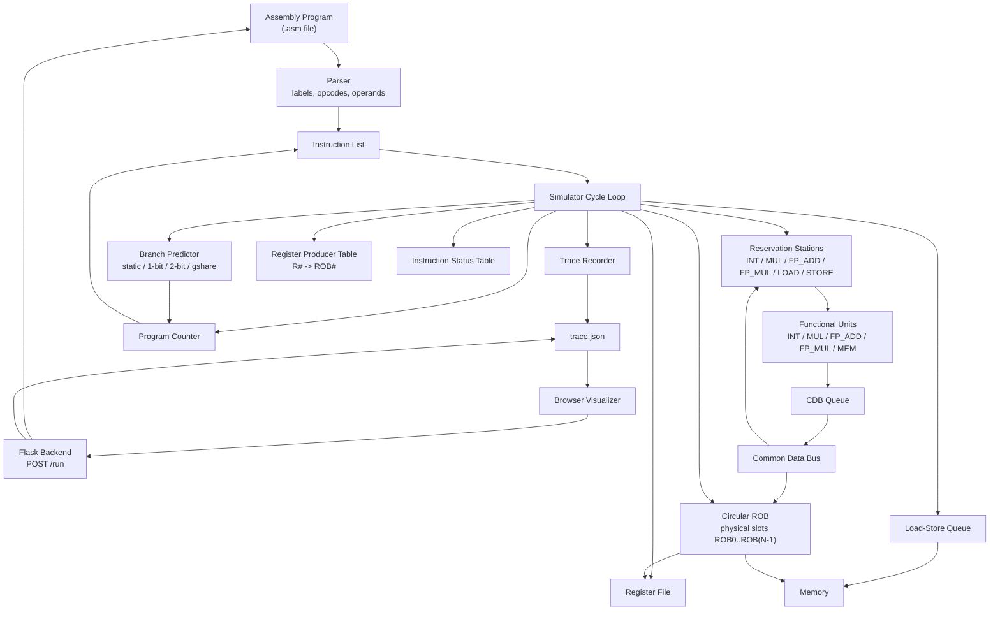

# Tomasulo Simulator

A cycle-based Tomasulo-style out-of-order CPU simulator written in C++, with a browser visualizer and a local Flask backend for running simulations from the web UI.

The goal is to show how instructions move through an out-of-order execution engine cycle by cycle: issue, reservation station wait, execution, CDB writeback, ROB commit, branch recovery, memory ordering, and trace visualization.

---

## Current Features

- In-order issue with out-of-order execution and in-order ROB commit
- Reservation stations for integer, multiply, FP-style, load, and store operations
- FP-style operations (`FADD`, `FSUB`, `FMUL`, `FDIV`) routed through separate FP resources
- Pipelined FP functional units with configurable pipeline counts, depths, and latencies
- FP pipeline stage data is exported in traces and shown in the browser visualizer
- Reservation station views distinguish waiting instructions from executing FU/pipeline state
- Load and store buffers backed by an LSQ
- Register renaming using physical ROB producer tags
- `Vj` / `Vk` / `Qj` / `Qk` operand dependency tracking
- Circular Reorder Buffer with reusable physical slots
- Separate dynamic instruction IDs (`I#`) and physical ROB tags (`ROB#`)
- Single-result Common Data Bus broadcast per cycle
- Store commit through the ROB
- Address-aware load/store handling through the LSQ
- Store-to-load forwarding from ready older stores
- Wrong-path flush support for reservation stations, ROB, CDB queue, LSQ, and register producer table
- Branch prediction modes:
  - `always-not-taken`
  - `always-taken`
  - `one-bit`
  - `two-bit`
  - `gshare`
- Branch misprediction recovery with PC redirect and younger-instruction flush
- Cycle-by-cycle debug output
- Instruction timing table and branch prediction summary
- Prediction Analysis mode for comparing all branch predictors on the same input program
- `.REG` and `.MEM` setup directives for initializing registers and memory before cycle 1
- Performance statistics output and frontend panel with IPC, stalls, CDB, branch, mix, and occupancy data
- Architecture Config tab for per-run ROB, RS, FU, latency, and FP pipeline settings
- `trace.json` export for visualization, including `architectureConfig` and `performanceStats`
- Browser visualizer for stepping through trace snapshots
- Local Flask backend for running assembly from the browser
- Automated test runner for final architectural state and selected commit counts

---

## Supported ISA

The parser supports this small custom ISA:

```asm
ADD  R1, R2, R3
ADDI R1, R1, 5
SUB  R1, R2, R3
MUL  R1, R2, R3
FADD R1, R2, R3
FSUB R1, R2, R3
FMUL R1, R2, R3
FDIV R1, R2, R3
LD   R1, offset(R2)
SD   R1, offset(R2)
BEQ  R1, R2, label
BNE  R1, R2, label
```

Labels can appear on their own line or before an instruction:

```asm
loop:
ADDI R1, R1, -1
BNE R1, R0, loop
```

### Setup Directives

Assembly files can initialize simulator state without adding real instructions:

```asm
.REG R10 0
.MEM 0 10
```

`.REG` sets an architectural register before cycle 1, and `.MEM` sets a memory address before cycle 1. These directives are not real instructions: they do not consume cycles, enter the ROB/RS/CDB, count as commits, or appear as executable PC lines. Static PCs are assigned only to real instructions.

---

## Architecture Overview


```mermaid
flowchart TD
    Program["Assembly Program<br/>(.asm file)"]
    Parser["Parser<br/>labels, opcodes, operands"]
    Instructions["Instruction List"]

    Backend["Flask Backend<br/>POST /run"]
    Visualizer["Browser Visualizer"]
    TraceFile["trace.json"]
    TraceRecorder["Trace Recorder"]

    Simulator["Simulator Cycle Loop"]
    PC["Program Counter"]
    BP["Branch Predictor<br/>static / 1-bit / 2-bit / gshare"]

    RS["Reservation Stations<br/>INT / MUL / FP_ADD / FP_MUL / LOAD / STORE"]
    FU["Functional Units<br/>INT / MUL / FP_ADD / FP_MUL / MEM"]
    CDBQ["CDB Queue"]
    CDB["Common Data Bus"]

    RegFile["Register File"]
    RegProducer["Register Producer Table<br/>R# -> ROB#"]
    ROB["Circular ROB<br/>physical slots ROB0..ROB(N-1)"]
    LSQ["Load-Store Queue"]
    Memory["Memory"]
    Status["Instruction Status Table"]

    Visualizer --> Backend
    Backend --> Program
    Program --> Parser
    Parser --> Instructions
    Instructions --> Simulator

    Simulator --> PC
    PC --> Instructions
    Simulator --> BP
    BP --> PC

    Simulator --> RS
    RS --> FU
    FU --> CDBQ
    CDBQ --> CDB
    CDB --> ROB
    CDB --> RS

    Simulator --> RegProducer
    Simulator --> RegFile
    Simulator --> ROB
    Simulator --> LSQ
    LSQ --> Memory
    ROB --> RegFile
    ROB --> Memory

    Simulator --> Status
    Simulator --> TraceRecorder
    TraceRecorder --> TraceFile
    TraceFile --> Visualizer
    Backend --> TraceFile
```

Instructions issue in program order, wait in reservation stations until operands and functional units are available, execute when ready, write register results through the CDB or non-register results directly into the ROB, and commit in order from the circular ROB head.

### Floating-Point Style Functional Units

The simulator supports `FADD`, `FSUB`, `FMUL`, and `FDIV`. These instructions currently use the same integer register/value model as the rest of the teaching ISA, but they are routed through separate FP reservation stations and functional units to model latency differences, structural hazards, and out-of-order scheduling behavior.

By default, FP_ADD is modeled as one 4-stage pipeline and FP_MUL as one 7-stage pipeline. These values can be changed per run from the Architecture Config tab or with command-line architecture overrides.

| Instruction | Reservation Station | Functional Unit | Latency |
|---|---|---|---|
| `FADD` | FP_ADD RS | FP_ADD FU, 1 pipeline, 4 stages | 4 |
| `FSUB` | FP_ADD RS | FP_ADD FU, 1 pipeline, 4 stages | 4 |
| `FMUL` | FP_MUL RS | FP_MUL FU, 1 pipeline, 7 stages | 7 |
| `FDIV` | FP_MUL RS | FP_MUL FU | 10 |

The table above shows the default configuration. Multiple `FMUL` instructions can overlap in the FP_MUL pipeline, and when multiple FP_MUL pipelines are configured, multiple ready `FMUL` instructions can start in the same cycle.

Normal `MUL` still uses the regular MUL reservation station and MUL functional unit. `FADD`/`FSUB` are separate from `FMUL`/`FDIV`, so FP_ADD and FP_MUL can be busy at the same time. In-order commit still applies: a younger completed instruction can wait in the ROB if an older long-latency FP instruction is ahead of it.

---

## ROB and Tag Model

The simulator separates dynamic instruction identity from physical ROB storage:

```text
I#    = dynamic instruction ID used for debug output and status tables
ROB#  = physical circular ROB slot used for renaming, dependencies, CDB wakeup, and commit storage
```

For example, dynamic instruction `I17` may occupy physical slot `ROB0`. Later, after that entry commits, `ROB0` may be reused by a newer instruction.

The register producer table and reservation station source tags store physical ROB tags:

```text
Register Producers:
  R2 <- ROB1

Active Instructions:
  I24: BNE R2, R0, loop | qj: ROB1
```

In trace and debug output, `activeInstructions` means in-flight issued instructions, not only reservation station entries. RS occupancy is derived from in-flight instructions that have not started executing. Once an instruction starts execution, it logically leaves the RS and is tracked by the FU or pipeline state while remaining in the in-flight instruction list until completion.

The CDB carries both identifiers:

```text
producerTag = dynamic instruction ID, used for printing/status table
robTag      = physical ROB slot, used for ROB writeback and dependency wakeup
```

---

## Cycle Timing Model

Each simulator cycle currently follows this order:

```text
1. Issue one instruction if possible
2. Execute / decrement active instructions
3. Print debug state
4. Commit one ready circular ROB head entry
5. Broadcast one old CDB result
6. Complete newly finished instructions
7. Queue new CDB/store/branch results
8. Record trace/debug snapshot
9. Advance to next cycle
```

A register-writing instruction that finishes execution in cycle `N` queues a CDB result at the end of cycle `N`, can broadcast in cycle `N + 1`, and can commit no earlier than cycle `N + 2` if it is at the ROB head.

The visual trace snapshot is captured around the cycle decision/debug point rather than as pure end-of-cycle cleanup. This keeps displayed stalls and final FP pipeline stages aligned with the cycle events shown in the visualizer.

Configurable latencies, functional-unit counts, ROB capacity, and reservation-station capacities affect when stalls and completions occur, but the cycle ordering above remains the same.

---

## Trace JSON

The simulator writes `trace.json` after each run. The browser visualizer uses this file as its cycle-by-cycle data source.

Top-level trace fields include:

- `architectureConfig`, recording the actual architecture parameters used for the run
- `performanceStats`, recording final run-level performance statistics
- `program`, containing executable instructions with static PCs
- `setupDirectives`, containing `.REG` / `.MEM` source lines when present

Each cycle snapshot includes fields such as:

- `cycle`
- `pc`
- `predictorType`
- `issuedInstruction`
- `cdbBroadcast`
- `commitEvent`
- `activeInstructions`
- `fuPipelines`
- `rsState`
- `rob.entries`, `rob.head`, `rob.tail`, `rob.count`
- `lsq`
- `registers`
- `memory`
- `registerProducers`
- `branchPredictions`
- `events`

The trace is intentionally additive: newer visualizer panels use newer fields, while older trace files without those fields should still load without crashing.

Newer traces include RS used/capacity information, ROB capacity, and FP pipeline rows/stages for the frontend. Frontend panels should render capacities from trace data instead of hardcoded defaults.

---

## Build

Requirements:

- C++17 compiler
- CMake
- Python 3 for tests and the visualizer backend
- Flask for the local backend

Build from the repository root:

```bash
cmake -S . -B build
cmake --build build
```

---

## Run with Docker

```bash
docker compose up --build
```

Then open:

```text
http://localhost:5000
```

This runs the Flask backend and browser visualizer. The simulator is built inside the container, and the local non-Docker build instructions still work.

---

## Run the Simulator Directly

Run the default program configured in `src/main.cpp`:

```bash
./build/simulator
```

Run a specific program:

```bash
./build/simulator examples/fibonacci_loop.asm
```

Choose a branch predictor:

```bash
./build/simulator examples/fibonacci_loop.asm --predictor two-bit
```

Override architecture parameters for one run:

```bash
./build/simulator tests/final_dynamic_matvec_2iter.asm --arch-config robCapacity=32,fpMulLatency=7,fpMulPipelineDepth=7
```

Omitted architecture fields keep their default values.

Accepted predictor names:

```text
always-not-taken
always-taken
one-bit
two-bit
gshare
```

Accepted aliases:

```text
not-taken
taken
1bit
1-bit
2bit
2-bit
g-share
```

Example FP resource run:

```bash
./build/simulator tests/fp_independent_units.asm
```

---

## Browser Visualizer

The browser visualizer runs assembly through the local Flask backend and renders the returned trace.

Current UI panels include:

- Cycle controls with previous/next, play/pause, and slider
- Optional `.asm` loader and program listing with PC highlight
- Branch predictor dropdown before running a simulation
- Prediction Analysis mode for comparing predictor modes on the same program
- Architecture Config tab for per-run ROB/RS/FU/latency/FP pipeline settings
- Architectural datapath view
- Functional unit state panel for INT, MUL, FP_ADD, FP_MUL, and MEM
- FP pipeline stage panel
- Pipelined FU slot usage display
- Events panel
- ROB table
- Reservation station and load/store buffer tables showing waiting instructions only
- LSQ table
- Register producer table
- Branch predictor summary and branch prediction table
- Register state table
- Memory state table
- Performance Statistics panel

Setup directives such as `.REG` and `.MEM` may be present in source files, but they are not shown as executable PC-highlighted instructions.

### Backend Setup

Create and activate a virtual environment:

```bash
python3 -m venv .venv
source .venv/bin/activate
```

Install Flask:

```bash
pip install Flask
```

Build the simulator before starting the backend:

```bash
cmake -S . -B build
cmake --build build
```

Run the backend from the repository root:

```bash
python3 server/app.py
```

Open:

```text
http://127.0.0.1:5000
```

### Backend Workflow

The backend is intended for local development only. By default it binds to `127.0.0.1`; Docker sets `FLASK_HOST=0.0.0.0` so the browser can reach the container.

When you click **Run Simulation**:

1. The frontend sends assembly code, the selected predictor mode, and optional `architectureConfig` to `POST /run`.
2. The backend writes the assembly to a temporary `.asm` file.
3. The backend forwards `architectureConfig` to `build/simulator` without a shell.
4. The simulator writes `trace.json` with `architectureConfig` and `performanceStats`.
5. The backend reads `trace.json` and returns it to the browser.
6. The visualizer renders the returned trace.

Prediction Analysis mode uses `POST /compare-predictors` and applies the same selected architecture configuration to every predictor run.

---

## Example Program

```asm
ADD R1, R3, R5
SUB R2, R3, R5
MUL R4, R3, R5
```

This tests arithmetic functions and committing to architectural register.

Expected behavior:

```text
I0: ADD R1, R3, R5 -> R1 = 7
I1: SUB R2, R3, R5 -> R2 = 3
I2: MUL R4, R3, R5 -> R4 = 10
```

---

## Debug Output

The simulator prints detailed cycle-by-cycle state, including:

```text
FU State
RS State
Register Producers
Active Instructions
CDB Queue
ROB
ROB Commit
CDB Broadcast
```

Example producer and wakeup output:

```text
Register Producers:
  R2 <- ROB1

Active Instructions:
  I24: BNE R2, R0, loop | qj: ROB1

CDB Broadcast: I23 SUB R2, R2, R5
  Broadcast: I23
  ROB Write: ROB1 / I23 value = 3 -> R2
  Wakeup: I24 qj resolved by ROB1 / I23 with value 3
```

The final output also includes the architectural register state, memory state, instruction timing table, branch prediction summary, and performance statistics such as total cycles, committed instructions, IPC, stall cycles/events, and branch accuracy.

---

## Tests

Automated tests are stored in `tests/`.

Run all tests:

```bash
python3 tests/run_tests.py
```

The test runner builds the simulator, runs every `.asm` file in `tests/`, and validates final architectural state plus selected commit counts.

Expectations are written in assembly comments:

```asm
# EXPECT_REG R1 5
# EXPECT_MEM 0 99
# EXPECT_COMMIT_COUNT ADD R2, R1, R3 1
```

The tests cover arithmetic, FP-style functional units, RAW dependencies, WAW-style renaming behavior, self-dependencies, CDB contention, out-of-order writeback, ROB capacity stalls, load-use dependencies, store commit behavior, LSQ memory ordering, store/load interactions, branches, nested loops, speculative execution, and wrong-path flush behavior.

Tests may use `.REG` and `.MEM` directives for setup without adding artificial setup cycles. Some tests check final architectural state and selected commit counts; timing-style tests can also be run manually with custom architecture settings.

A small GUI helper can generate test files:

```bash
python3 tests/create_test.py
```

---

## Current Limitations

- The ISA is a small custom teaching ISA, not full RISC-V.
- FP instructions use integer values, not IEEE floating-point values.
- Architecture parameters can be configured per run from the frontend, but not every microarchitectural feature is configurable yet.
- The simulator issues at most one instruction per cycle.
- The CDB broadcasts at most one result per cycle; CDB bandwidth is still fixed at one broadcast per cycle.
- `FDIV` currently shares FP_MUL resources.
- FP pipeline stages are visual/resource-tracking state, while full instruction state remains in the in-flight instruction list.
- The memory model is simplified.
- LSQ behavior supports address-aware ordering and forwarding, but it is still a simplified model rather than a production CPU memory subsystem.
- Automated tests focus on final architectural correctness and selected commit counts more than exhaustive microarchitectural timing validation.
- The Flask backend is local-development only and should not be exposed publicly.

---

## Planned Features

- Additional architecture presets and broader config coverage
- More detailed statistics, charts, and per-cycle cumulative views
- Additional branch predictor experiments
- More visual animation and interaction in the browser
- Stronger automated validation of branch prediction statistics
- Static hosted demo with sample traces
- More automated timing validation
- True floating-point register/value support later
- Optional packaging or Docker setup later

---

## Project Status

The simulator currently implements Tomasulo-style out-of-order execution with reservation stations, physical ROB-tag-based register renaming, a single-broadcast CDB, a true circular ROB with reusable slots, in-order commit, branch speculation and recovery including GShare, LSQ-based memory ordering, setup directives for initial state, pipelined FP functional units, per-run architecture configuration, performance statistics, trace export with FP pipeline visualization, Prediction Analysis mode, and a browser visualizer backed by a local Flask server.
